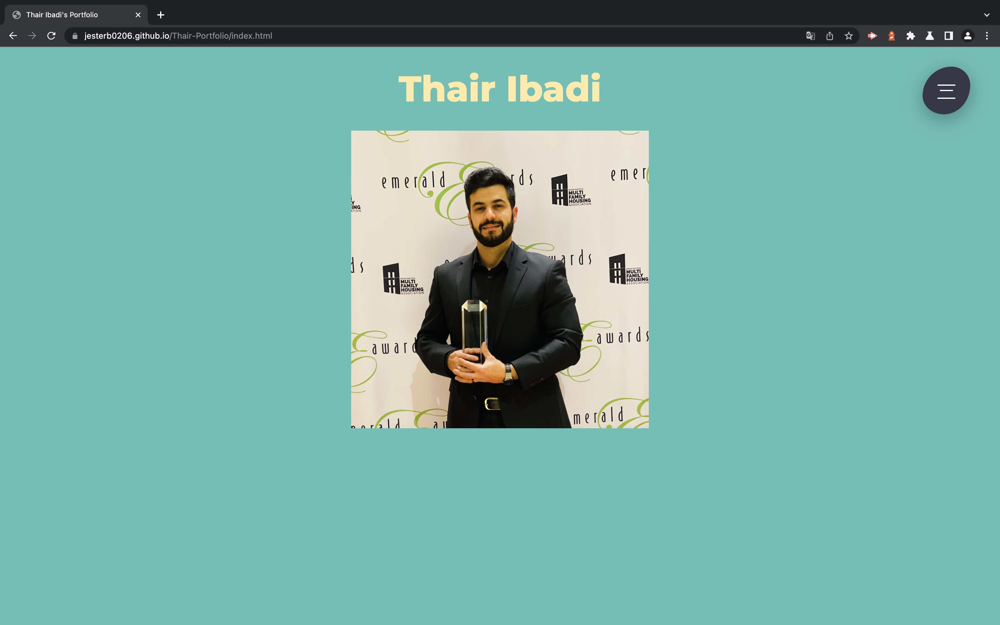
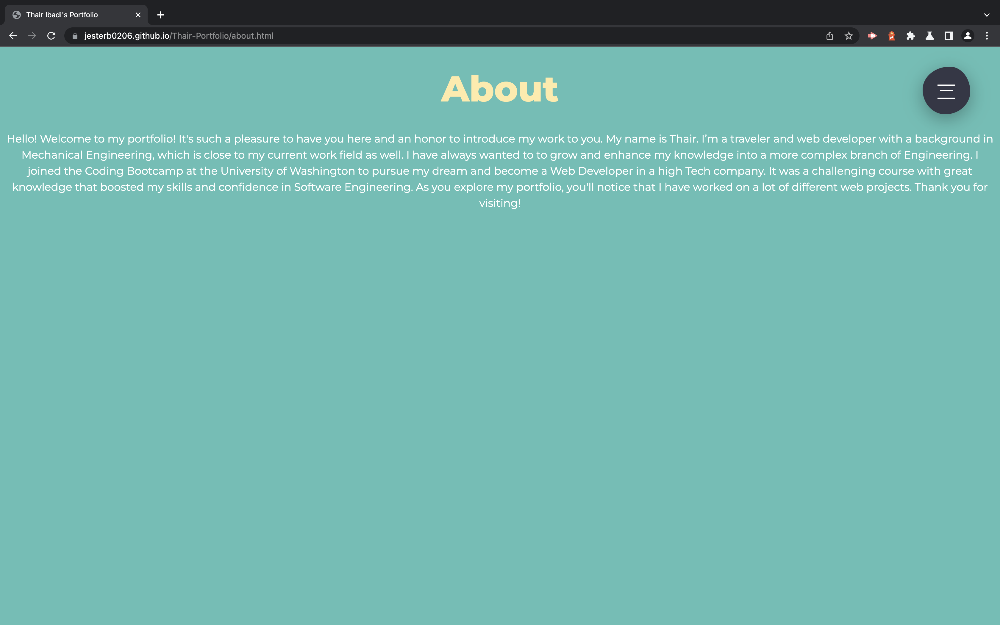
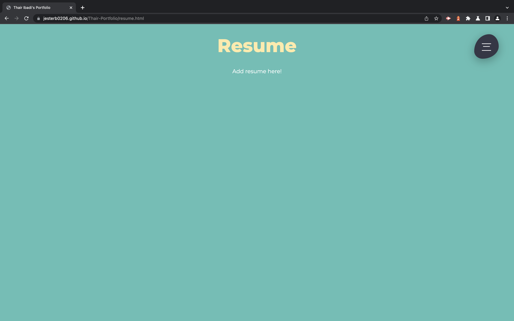
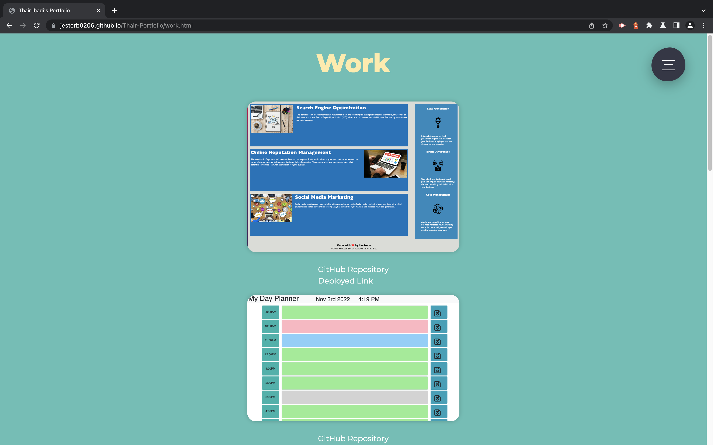
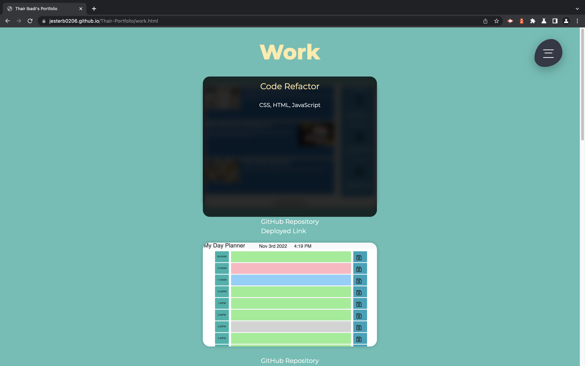
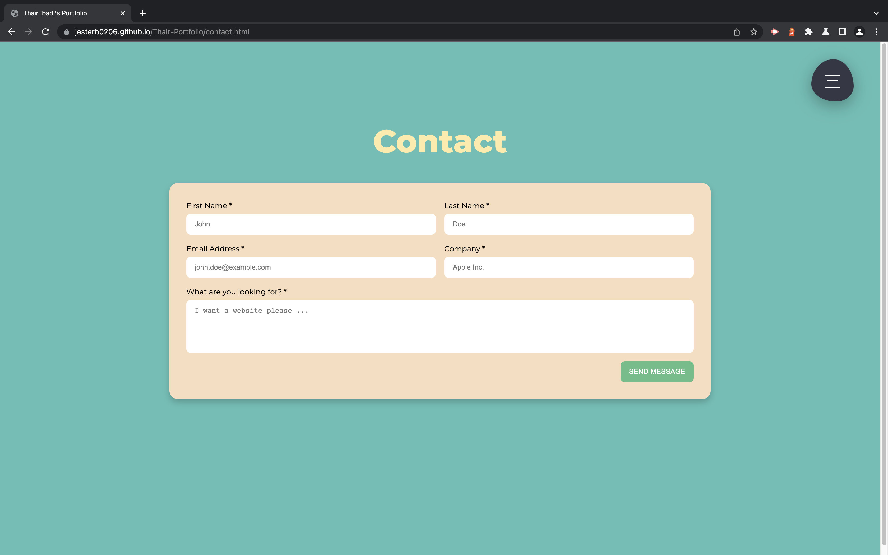
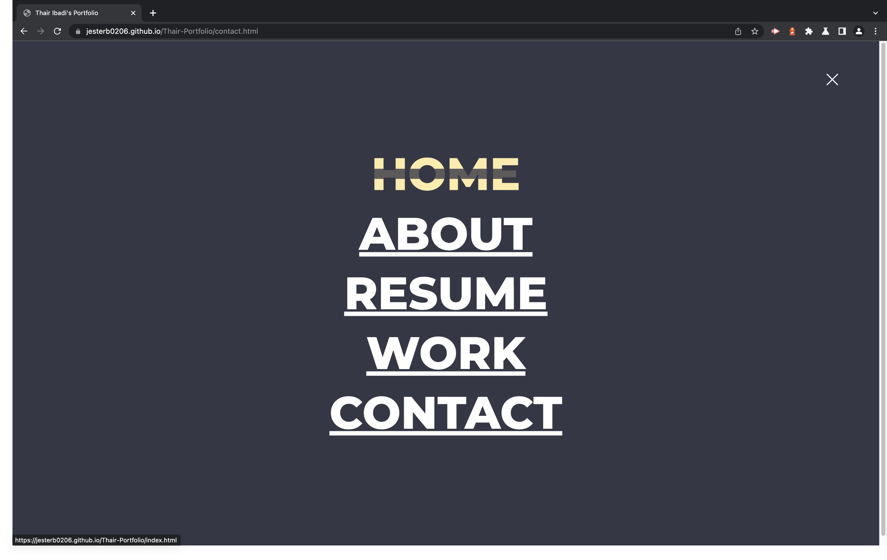

# Thair Portfolio

## License

[This application is under the MIT license](https://opensource.org/licenses/MIT)

## Contributors

[Bradley Jester](https://github.com/jesterb0206) 👈 Click there to view Bradley's GitHub account!

[Thair Ibadi](https://github.com/Thair-i) 👈 Click there to view Thair's GitHub account!

## Deployment Link

**To-Do**

👆 Click there!

## Images

